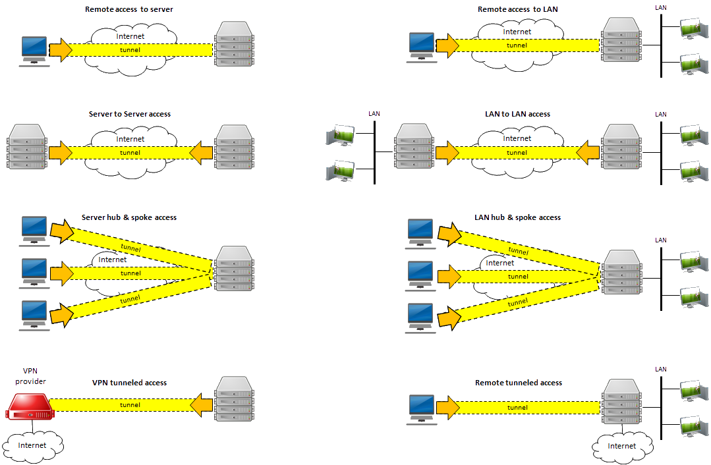

# the-wireguard-effect

the-wireguard-effect has turned into a couple of things. It started as a `Cross platform wireguard api client for nodejs built on wireguard-go with effect-ts`, but has since added a cross platform CLI to control some wireguard interfaces without needing to install anything, a wireguard demo server that implements the same protocol as demo.wireguard.com so it will work with all the existing examples, a lot of helpers and examples for config generation, and unit + e2e testing.

## Motivation/ideation :bulb:

The motivation for this project came from wanting to create wireguard configurations and ultimately control a wireguard interface from JS for a different project of mine. The motivation for adding the CLI, demo-server, config generation, and testing/experiments came from me wanting to experiment with and learn more about wireguard .

## Goals :white_check_mark:

- [x] - fully typed wireguard configurations (thanks to @effect/schema)
- [x] - doesn't require wireguard to be installed (ships with most prebuilds)
- [x] - cross platform (supports linux amd64, linux arm64, mac amd64, mac arm64, and windows amd64)
- [x] - userspace api implementation (the [Wireguard cross platform docs](https://www.wireguard.com/xplatform/) have details about it.)
- [x] - strong control over how the interface is managed across all platforms.

## WIP/Todo :construction:

- Implement wg cli clone
- QR code generation
- Obtain wintun drivers from public source and check hash during build, rather than just uploading them (https://github.com/leonitousconforti/the-wireguard-effect/issues/62)
- FreeBSD and OpenBSD support (https://github.com/leonitousconforti/the-wireguard-effect/pull/104)

## Blocked :ambulance:

- Windows arm64 support, I simply do not have any device to test against and would prefer not to ship blindly. If someone would like to contribute a self-hosted windows arm64 github runner that could occasionally be used for running the CI tests, that would unblock this!

## Non-Goals :wastebasket:

- Utilities for installing or checking if wireguard is installed on the system.
- NAT traversal utilities
- Utilities to configure network interfaces or generation of any iptables or nftables rules when bringing a config up using the userspace api.

## Notes :memo:

Here is some content I am stealing from the [Unraid forums](https://forums.unraid.net/topic/84226-wireguard-quickstart/)

 - Remote access to server: Use your phone or computer to remotely access just the wireguard server.
 - Remote access to LAN: Builds on "Remote access to server", allowing you to access your entire LAN as well.
 - Server to server access: Allows two servers to connect to each other.
 - LAN to LAN access: Builds on "Server to server access", allowing two entire networks to communicate.
 - Server hub & spoke access: Builds on "Remote access to server", except that all of the VPN clients can connect to each other as well. Note that all traffic passes through the server.
 - LAN hub & spoke access: Builds on "Server hub & spoke access", allowing you to access your entire LAN as well.
 - VPN tunneled access: Route specific traffic through a commercial WireGuard VPN provider
 - Remote tunneled access: Securely access the Internet from untrusted networks by routing all of your traffic through the VPN and out the server's internet connection

You can find examples for how to generate configs for each type of configuration displayed above in the [examples](./examples/) directory.

## Library docs :card_file_box:

[https://leonitousconforti.github.io/the-wireguard-effect/](https://leonitousconforti.github.io/the-wireguard-effect/)

## Security :closed_lock_with_key: :rotating_light:

the-wireguard-effect is not an official WireGuard project, and WireGuard is a registered trademark of Jason A. Donenfeld. The is a hobby project of mine, it has not received an independent security audit and never will. If that bothers you then don't use it.

## Contributing and getting help :speech_balloon: :beers:

Contributions, suggestions, and questions are welcome! If you are interested in developing, my recommendation is going to be to use the Devcontainer (even if you don't like them) as it has everything setup already to run the tests or to just let Github actions run the tests. I'll review prs and respond to issues/discussion here on GitHub but if you want more synchronous communication you can find me in the [effect discord](https://discord.gg/effect-ts) as @leonitous
